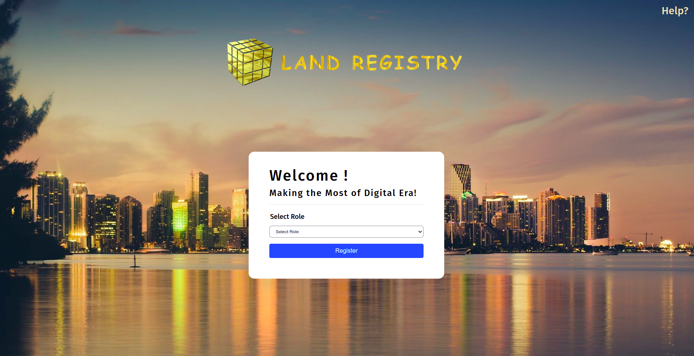
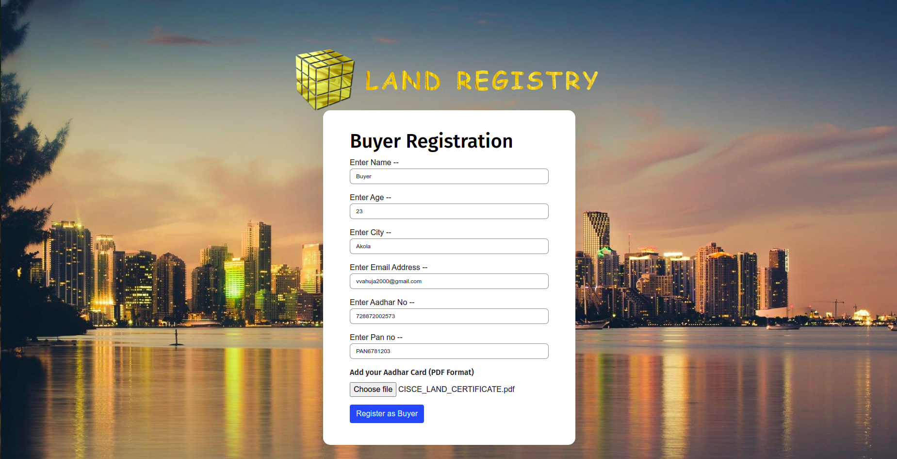
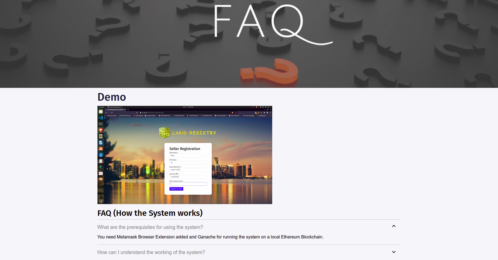
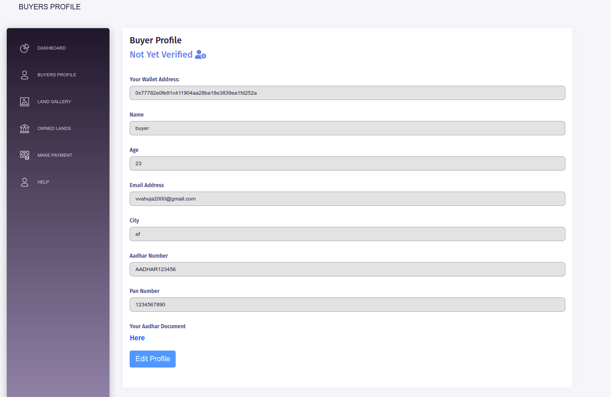

Absolutely! Here's a **complete, polished, GitHub-ready README** for your Land Registration System project, fully structured and professional:

---

# üè° Afriland: Land Registration System with Blockchain

**Presented at IEEE ICAECC'23** — [Checkout Paper](https://ieeexplore.ieee.org/document/10560138)


---

## üìñ Project Overview

Land registration in India and many other regions is **slow, cumbersome, and prone to fraud**. Traditional systems often result in lost paperwork, lengthy court cases, and inefficient record maintenance.

This **Blockchain-based Land Registration System** aims to:

* Provide a **secure, transparent, and fast process** for land registration.
* Reduce **fraud** through an **immutable ledger** of transactions.
* Enable **buyers, sellers, and government registrars** to transfer land ownership seamlessly.
* Validate lands efficiently using blockchain verification.

This system decentralizes land registration to make it **efficient, reliable, and tamper-proof**.

---

## ⚙️ Technology Stack

**Frontend:**

* JavaScript & React
* CSS
* MetaMask Chrome Extension

**Backend / Blockchain:**

* Ethereum Blockchain (Truffle Suite)
* Solidity Smart Contracts
* Ganache (Local Ethereum Blockchain)

---

## üåü Features

### User Management

* **Registration Page:** Buyers & Sellers can register accounts.
* **User Profile:** View and edit profile information.
* **Verification:** Land Inspector verifies users.

### Seller Dashboard

* Add new lands after verification.
* Approve land requests from buyers.
* View land details and documents.

### Buyer Dashboard

* Browse available lands.
* Request to purchase land.
* View **owned lands** post-purchase.
* Make payments to sellers.

### Admin / Land Inspector

* Verify buyers, sellers, and land transactions.
* Approve land ownership transfers.

---

## üöÄ Installation & Running the Application

1. Clone the repository:

```bash
git clone https://github.com/tsi1221/Afriland.git
cd Afriland
```

2. Start **Ganache** and keep it running in the background.

3. Ensure **MetaMask** extension is installed in your browser.

4. Deploy smart contracts:

```bash
truffle migrate --reset
```

5. Install frontend dependencies:

```bash
cd client
npm install
```

6. Start the frontend:

```bash
npm start
```

---

## üé• Demo

[Watch the project demo](https://youtu.be/6VLaAa8GNDc)

---

## 🖼 Screenshots

|                   Landing Page                   |                   Buyer Registration                  |
| :----------------------------------------------: | :---------------------------------------------------: |
|  |  |

|                      Buyer Dashboard                     |                      Seller Dashboard                      |
| :------------------------------------------------------: | :--------------------------------------------------------: |
|  |  |

|                 Add Land (Seller)                 |                 View All Lands Details                |
| :-----------------------------------------------: | :---------------------------------------------------: |
|  |  |

|                   Help & FAQ                  |                Verify Buyer (Inspector)               |
| :-------------------------------------------: | :---------------------------------------------------: |
|  |  |

|               Approve Land Request (Seller)              |                 Payment by Buyer                 |
| :------------------------------------------------------: | :----------------------------------------------: |
|  |  |

|             Verify Land Transaction (Inspector)             |                  Owned Lands (Buyer)                 |
| :---------------------------------------------------------: | :--------------------------------------------------: |
|  |  |

|               View Profile (Before Verification)              |                 Edit Profile (After Verification)                 |
| :-----------------------------------------------------------: | :---------------------------------------------------------------: |
|  |  |

---

## ⭐ Star & Contributors

If you find this project useful, please **star the repository**!


[](https://github.com/tsi1221/Afriland/stargazers)
[](https://github.com/tsi1221/Afriland/graphs/contributors)

---
